# Sincronização Bidirecional de Status - Orders

## 🎯 Critérios 12-13 de Homologação

**Requisitos:**

- Atualizar status de pedidos cancelados pelo cliente/iFood
- Atualizar status confirmado/cancelado por outro app
- Sincronizar mudanças de status em tempo real

## ✅ Implementação

### 1. Detecção Automática de Mudanças (Backend)

O `SyncOrdersJob` agora detecta mudanças de status automaticamente:

```php
// Busca pedido existente
$existingOrder = Order::where('tenant_id', $tenantId)
    ->where('order_uuid', $orderId)
    ->first();

$oldStatus = $existingOrder?->status;
$newStatus = data_get($detail, 'status', $eventCode);

// Atualiza pedido
$order = Order::updateOrCreate(/* ... */);

// Detecta e loga mudanças
if ($existingOrder && $oldStatus !== $newStatus) {
    logger()->info('🔄 Status do pedido atualizado', [
        'old_status' => $oldStatus,
        'new_status' => $newStatus,
        'cancelled_by_customer' => in_array($newStatus, ['CANCELLED', 'CANCELLATION_REQUESTED']),
    ]);

    // Dispara evento para broadcasting
    event(new OrderStatusChanged($order, $oldStatus, $newStatus));
}
```

### 2. Tipos de Mudanças Detectadas

| Tipo                          | Status                            | Origem           | Comportamento        |
| ----------------------------- | --------------------------------- | ---------------- | -------------------- |
| **Cancelamento pelo cliente** | CANCELLED, CANCELLATION_REQUESTED | App iFood        | Log warning + evento |
| **Confirmação externa**       | CONFIRMED                         | Outro app/tablet | Log info + evento    |
| **Despacho externo**          | DISPATCHED                        | Outro app        | Log info + evento    |
| **Conclusão externa**         | CONCLUDED                         | Sistema iFood    | Log info + evento    |

### 3. Broadcasting (Tempo Real - Opcional)

#### Evento: `OrderStatusChanged`

**Canal:** `orders.tenant.{tenant_id}`  
**Nome:** `order.status.changed`

**Payload:**

```json
{
    "order_id": 123,
    "order_code": "ABC-123",
    "order_uuid": "uuid-here",
    "old_status": "PLACED",
    "new_status": "CANCELLED",
    "cancelled_by_customer": true,
    "message": "Pedido #ABC-123 foi cancelado"
}
```

#### Configuração Laravel Echo

1. **Instalar dependências:**

```bash
npm install --save laravel-echo pusher-js
# OU
npm install --save laravel-echo soketi-js
```

2. **Configurar Echo (`resources/js/echo.ts`):**

```typescript
import Echo from 'laravel-echo';
import Pusher from 'pusher-js';

window.Pusher = Pusher;

window.Echo = new Echo({
    broadcaster: 'pusher',
    key: import.meta.env.VITE_PUSHER_APP_KEY,
    cluster: import.meta.env.VITE_PUSHER_APP_CLUSTER,
    forceTLS: true,
});
```

3. **Descomentar código em `use-order-status-listener.ts`:**

```typescript
const channel = window.Echo.channel(`orders.tenant.${tenantId}`);

channel.listen('.order.status.changed', (event) => {
    if (event.cancelled_by_customer) {
        toast.error('Pedido Cancelado', {
            description: event.message,
        });
    }

    router.reload({ only: ['orders'] });
});
```

### 4. Polling (Implementação Atual)

**Sem broadcasting**, o sistema usa polling automático:

#### Frontend (React)

- Hook `useOrderStatusListener`
- Recarrega lista a cada 30 segundos
- Usa `router.reload({ only: ['orders'] })`
- Não afeta scroll ou estado do usuário

#### Backend (Laravel)

- Comando `ifood:polling` roda a cada 30 segundos
- `SyncOrdersJob` busca eventos novos
- Status atualizado automaticamente via `updateOrCreate`

### 5. Logs de Auditoria

**Mudanças de status são logadas com detalhes:**

```log
[2025-10-17 18:30:15] local.INFO: 🔄 Status do pedido atualizado
{
    "order_id": 456,
    "order_code": "XYZ-789",
    "old_status": "PLACED",
    "new_status": "CONFIRMED",
    "event_code": "CFM",
    "cancelled_by_customer": false
}

[2025-10-17 18:35:22] local.WARNING: ⚠️ Pedido cancelado externamente
{
    "order_code": "ABC-123",
    "old_status": "CONFIRMED",
    "cancellation_reason": "Cliente não atende"
}
```

### 6. Mensagens por Status

| Status          | Mensagem                                   |
| --------------- | ------------------------------------------ |
| CANCELLED       | "Pedido #{code} foi cancelado"             |
| CONFIRMED       | "Pedido #{code} foi confirmado"            |
| DISPATCHED      | "Pedido #{code} saiu para entrega"         |
| READY_TO_PICKUP | "Pedido #{code} está pronto para retirada" |
| CONCLUDED       | "Pedido #{code} foi concluído"             |
| Outros          | "Pedido #{code} mudou de status"           |

## 🔄 Fluxos de Sincronização

### Fluxo 1: Cancelamento pelo Cliente

```mermaid
sequenceDiagram
    Cliente->>iFood API: Cancela pedido
    iFood API->>Polling: Evento CANCELLED
    Polling->>SyncOrdersJob: Processa evento
    SyncOrdersJob->>Database: Atualiza status
    SyncOrdersJob->>Log: 🔄 Status atualizado
    SyncOrdersJob->>Log: ⚠️ Cancelado externamente
    SyncOrdersJob->>Event: OrderStatusChanged
    Event->>Frontend: Broadcasting (opcional)
    Frontend->>UI: Recarrega lista
    Frontend->>UI: Toast de notificação
```



### Fluxo 2: Confirmação em Outro App

```mermaid
sequenceDiagram
    Outro App->>iFood API: Confirma pedido
    iFood API->>Polling: Evento CONFIRMED
    Polling->>SyncOrdersJob: Processa evento
    SyncOrdersJob->>Database: Atualiza status
    SyncOrdersJob->>Log: 🔄 Status atualizado
    SyncOrdersJob->>Event: OrderStatusChanged
    Event->>Frontend: Broadcasting (opcional)
    Frontend->>UI: Recarrega lista
```



## 📊 Monitoramento

### Verificar mudanças de status

```bash
# Logs de mudanças
tail -f storage/logs/laravel.log | grep "Status do pedido atualizado"

# Cancelamentos externos
tail -f storage/logs/laravel.log | grep "cancelado externamente"
```

### Query para auditar mudanças

```sql
-- Pedidos que tiveram status alterado recentemente
SELECT
    id,
    code,
    status,
    updated_at
FROM orders
WHERE updated_at > DATE_SUB(NOW(), INTERVAL 1 HOUR)
ORDER BY updated_at DESC;
```

## 🧪 Testes

### Teste 1: Cancelamento pelo Cliente

1. Criar pedido de teste no app iFood
2. Cancelar pelo app do cliente
3. Aguardar até 30 segundos
4. Verificar logs:
    ```
    🔄 Status do pedido atualizado
    ⚠️ Pedido cancelado externamente
    ```
5. Confirmar status CANCELLED no sistema

### Teste 2: Confirmação em Outro App

1. Criar pedido de teste
2. Confirmar em outro dispositivo/app
3. Aguardar polling
4. Verificar status CONFIRMED sincronizado
5. Verificar log de mudança

### Teste 3: Atualização na UI

1. Abrir tela de pedidos
2. Em outro dispositivo, alterar status de um pedido
3. Aguardar 30 segundos (polling)
4. Verificar atualização automática na lista
5. (Com broadcasting) Verificar toast de notificação

## ❓ Troubleshooting

### Status não sincroniza

- Verificar se polling está rodando: `php artisan ifood:polling`
- Verificar logs: `tail -f storage/logs/laravel.log`
- Confirmar token OAuth válido
- Verificar conectividade com API iFood

### Broadcasting não funciona

- Verificar configuração Pusher/Soketi em `.env`
- Confirmar queue worker rodando: `php artisan queue:work`
- Verificar console do navegador por erros Echo
- Testar conexão WebSocket

### UI não atualiza

- Verificar hook `useOrderStatusListener` importado
- Confirmar `tenant_id` sendo passado corretamente
- Verificar console por erros JavaScript
- Limpar cache do navegador

## 📚 Documentação iFood

- [Events API](https://developer.ifood.com.br/docs/events-api)
- [Order Status Flow](https://developer.ifood.com.br/docs/order-status)
- [Webhooks vs Polling](https://developer.ifood.com.br/docs/eventos#polling-vs-webhooks)
